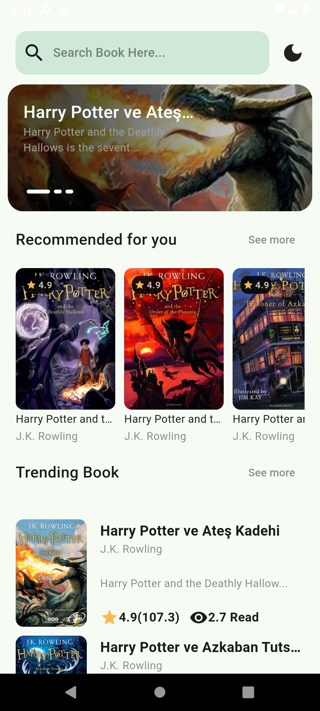
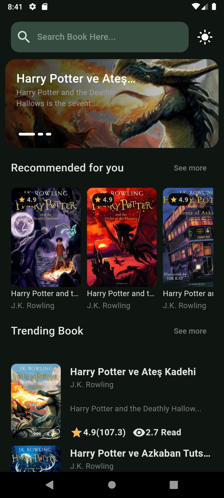
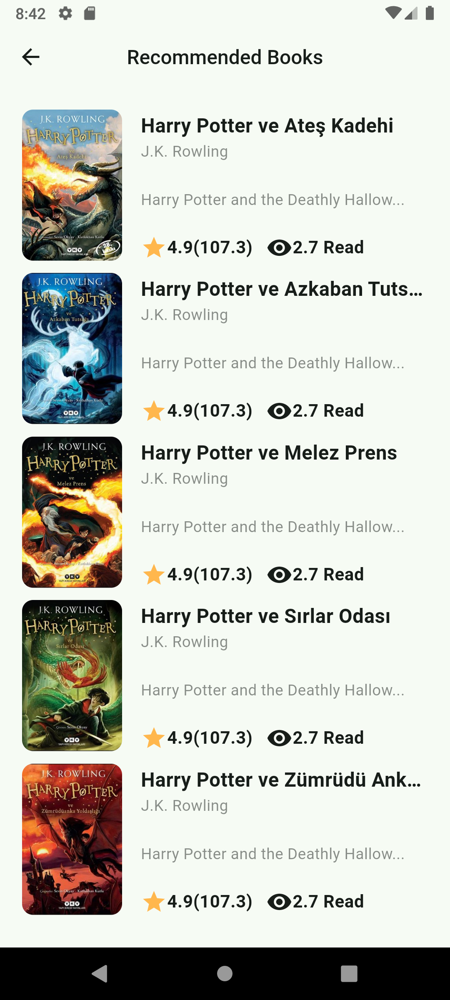
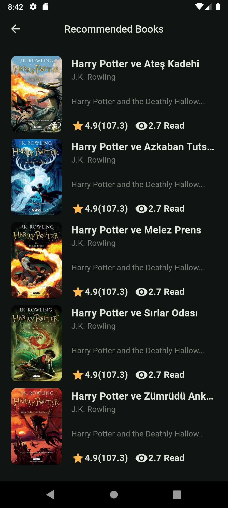
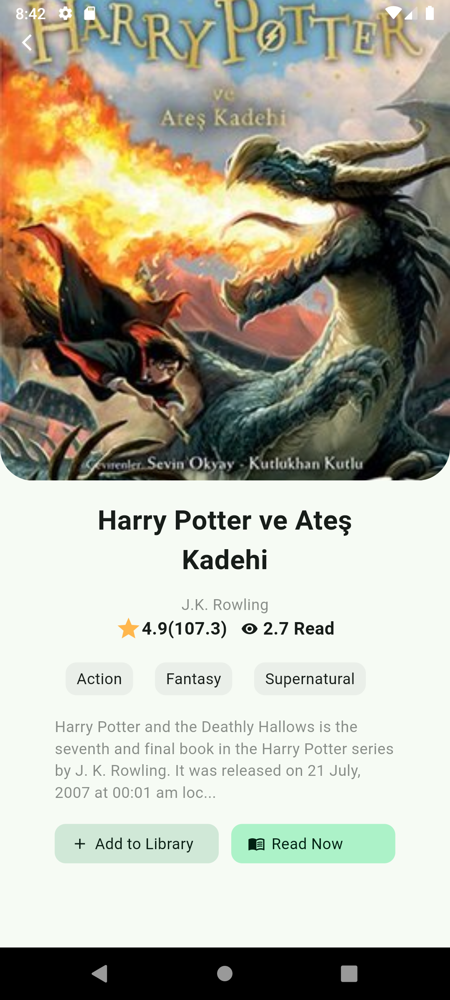
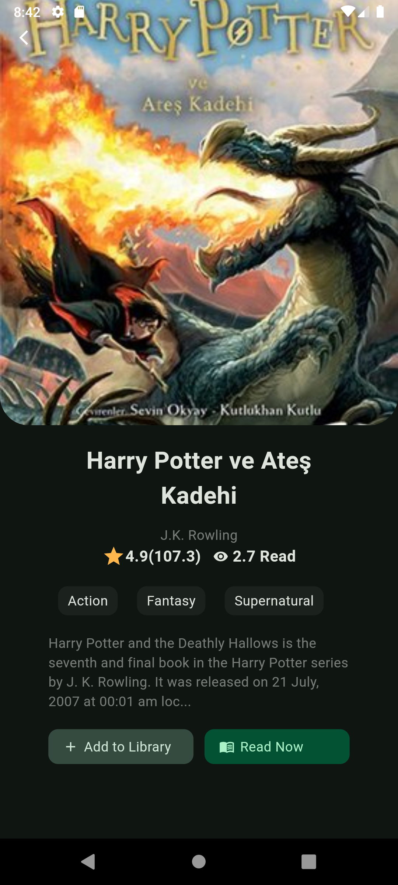

# Book UI App

This is a simple Book UI app built with Flutter. The app features a static dataset representing books and supports both light and dark modes. Theme mode toggling is implemented using the Cubit state management package from flutter_bloc.

## Features
 - Static Book Data: The app uses a set of static data to display a list of books.
 - Light and Dark Themes: Users can toggle between light and dark themes.
 - State Management: Theme toggling is managed using Cubit from the flutter_bloc package.

## screenshots

&nbsp;&nbsp;

&nbsp;&nbsp;

&nbsp;&nbsp;

&nbsp;&nbsp;